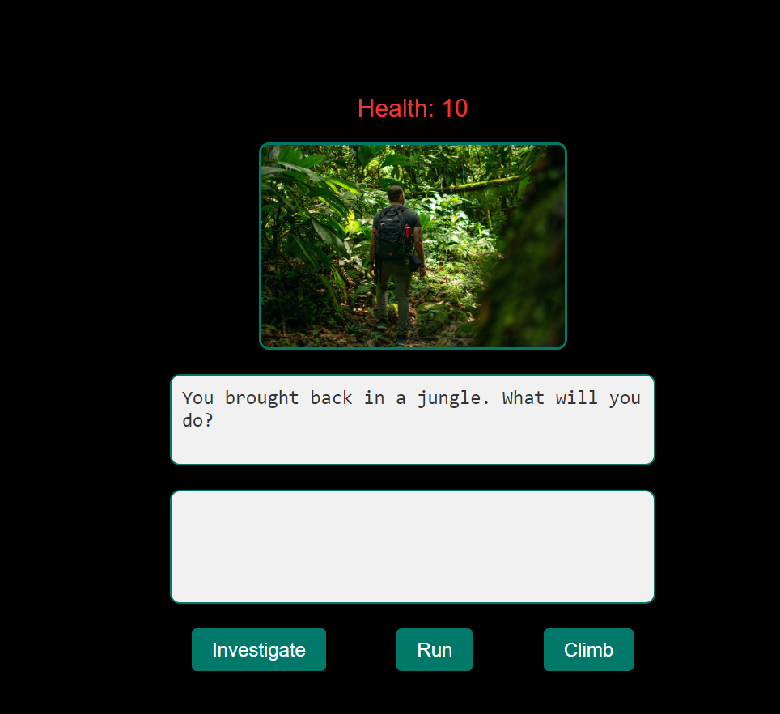

# Escape the Jungle

**Escape the Jungle** is a fun, interactive game where you make choices to survive in a jungle and try to escape safely.
## Pseudocode

### Story Paths
- **Description**: An array of objects, each representing a scenario in the jungle.
- **Contents**: Each object includes:
  - `prompt`: Describes the current situation for the player.
  - `image`: Image that visually represents the current scenario.
  - `choices`: Player's options to progress.
  - `outcomes`: Results based on player's choices.
  - `healthEffects`: Positive or negative health adjustments based on choices.

### Game Variables
- **currentStoryIndex**: Keeps track of the player's position in the story.
- **playerHealth**: Stores the player's health status throughout the game.

### Render Story Function
- **Purpose**: Displays the current scenario, including:
  - `prompt`: Updates the prompt text.
  - `image`: Shows the relevant image.
  - `choices`: Updates the choice buttons for the player.

### Handle Choice Function
- **Purpose**: Executes logic when a player makes a choice:
  - Updates the `outcome` text based on the selected choice.
  - Adjusts `playerHealth` according to the choice.
  - Ends the game if `playerHealth` is zero or below.
  - If "AcceptHelp" is chosen, displays a completion message.
  - Moves to the next scenario if available, with a delay for a smooth transition.

### Restart Game Function
- **Purpose**: Resets the game to initial settings:
  - Resets `playerHealth` to the starting value.
  - Sets `currentStoryIndex` to the first scenario.
  - Enables buttons and starts the game from the beginning.

### Event Listeners
- **Listens for**:
  - **Choice buttons**: Captures player's choices and triggers the `handleChoice` function.
  - **Restart button**: Resets the game by calling `restartGame` function, allowing for a new playthrough.

## How to Play

1. **Goal**: Survive the jungle and find a way out. Each choice you make changes the story and your health.

2. **Starting the Game**: 
   - Read the situation described in the prompt.
   - Choose one of the three options by clicking a button.

3. **Making Choices**: 
   - Each button represents a different decision.
   - Some choices will help you; others might make you lose health.
   - Example: Investigating might reveal a safe path, while running might cause an injury.

4. **Health**:
   - You start with 10 health points.
   - If your health reaches zero, the game ends with "GAME OVER."
   - If you make it out of the jungle safely, you will see a message saying "You have completed the story!"

5. **Restarting the Game**: 
   - After a game over or finishing the story, click "Restart Game" to start again with full health.

6. **Different Story Paths**:
   - The story changes based on your choices. For example, running away might lead to a dragon, while investigating could reveal a cave.
   - Choose wisely for a different adventure each time.

   ## Technologies Used

- **JavaScript**: Handles the game logic, story progression, and player interactions.
- **HTML**: Structures the game’s interface.
- **CSS**: Styles the game and adds visual appeal.
- **GitHub**: For version control and project management.

To play the game please click the link  [Escape the Jungle](https://naimjalal.github.io/Browser-based-Game-Project/)